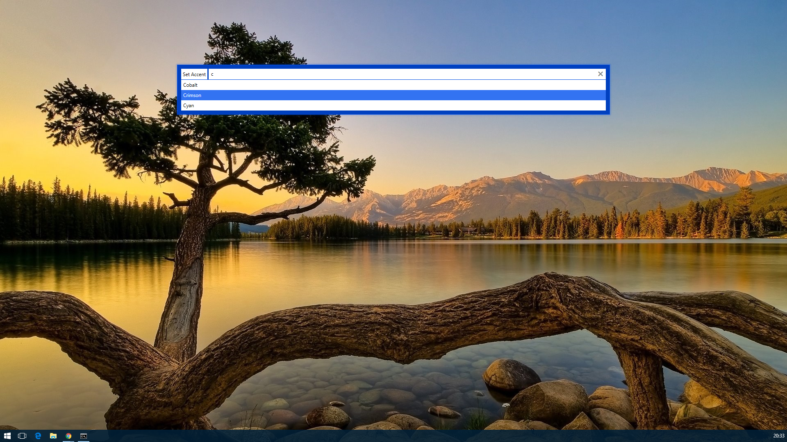
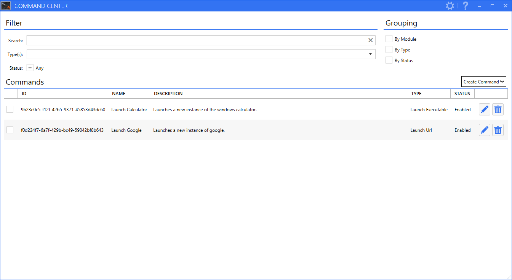
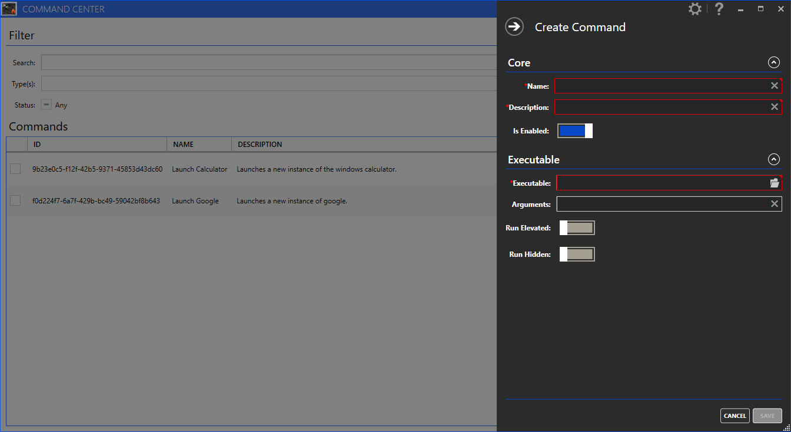
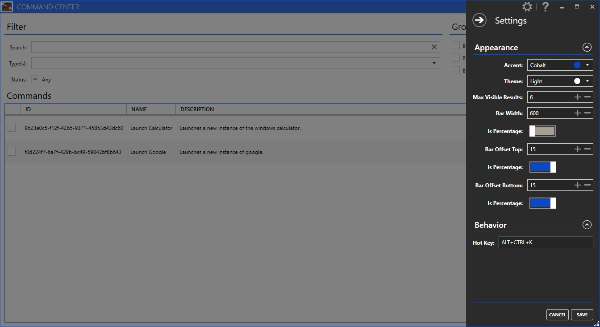
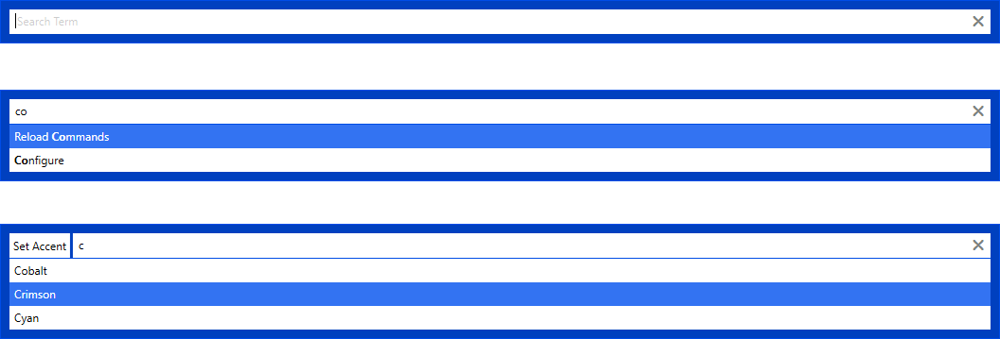

HotCommander
=============

HotCommander is a hot key and voice activated command bar utility. This repository contains the core framework and a WPF UI implementation.

Getting started
---------------

### Download

Several quick start options are available for development:

+ Install with [NuGet](https://www.nuget.org): `nuget install ShaneYu.HotCommander.Core`.
+ Install with VS Nuget Package Manager: `Install-Package ShaneYu.HotCommander.Core`.
+ Clone the repo: `git clone https://github.com/shaneyu/shaneyu.hotcommander.git`.

Installing and running the WPF UI:

+ [Download the latest release](https://www.nuget.org/packages/ShaneYu.HotCommander/).
+ Install with [Chocolately](https://chocolatey.org/): `choco install HotCommander`.

### Screenshots

    

### Want to help?

Want to file a bug, contribute some code, or improve documentation? Excellent! Read up on our guidelines for [contributing](contributing.html) and then check out all of our [issues](https://github.com/ShaneYu/ShaneYu.HotCommander/issues).

Usage Guide
============

Basics
-------

### Configuration

Coming soon...

### Create a URL command

Coming soon...

### Create a URL command with tokens

Coming soon...

Modules
=======

Basics
-------

### Project Setup

Coming soon...

### Register a new command type

Coming soon...

### Register a fixed command

Coming soon...

Advanced
---------

### Custom Validators

Coming soon...

Tutorial
---------

### My first module

Coming soon...

Existing Modules
-----------------

Coming soon...

Acknowledgements
================

© 2016, Shane Yu. Released under the [MIT 
License](https://raw.githubusercontent.com/ShaneYu/ShaneYu.HotCommander/master/LICENSE).

### Flatdoc
[Flatdoc](http://ricostacruz.com/flatdoc/) is authored and maintained by [Rico Sta. Cruz](http://ricostacruz.com) with help from it's [contributors](http://github.com/rstacruz/flatdoc/contributors).

### MahApps Metro
[MahApps Metro](http://mahapps.com/) was a project started by [Paul Jenkins](http://vikingco.de/) back in 2011 and is maintained with help from it's [contributors](https://github.com/MahApps/MahApps.Metro/graphs/contributors).